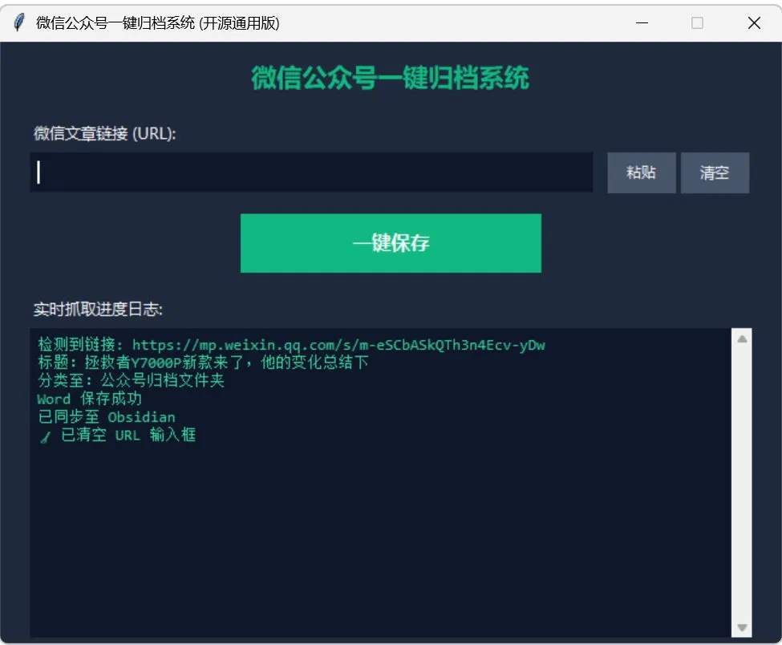

# 微信公众号一键归档系统 (WeChat Archive Tool)


一键抓取微信公众号文章，自动排版为符合国标规范的 Word 文档，并同步归档至 Obsidian 知识库，帮助建筑、港口、HSE、工程管理等行业从业人员快速建立个人专业知识库。

##  项目背景

日常工作中经常会遇到值得留存的公众号文章（行业动态、技术规范、安全案例等），手动复制、排版、分类归档非常琐碎。这个工具是我给自己写的一套自动化流程，把这件事从"手动搬运"变成"一键完成"。

##  核心功能

### 1. 一键抓取
复制微信公众号文章链接，点击一键保存，自动完成正文抓取，无需手动复制粘贴。

### 2. 公文级标准排版
自动将文章排版为符合《党政机关公文格式》（GB/T 9704-2012）国家标准的 Word 文档：
* 标题：居中 2 号方正小标宋
* 正文：3 号仿宋体
* 行间距：28~30 磅
* 首行缩进 2 字符
* 页边距：天头 37mm、地脚 35mm、左 28mm、右 26mm

排版基于内置的黄金模板，生成后无需二次调整，可直接呈报或存档。

### 3. 双轨归档：Word + Obsidian
生成 `.docx` Word 文档的同时，可同步在 Obsidian 知识库中生成对应的 `.md` 笔记，实现"呈报用 Word、个人知识库用 Markdown"的双向流转。

### 4. 关键词自动分类
根据文章标题及正文前 200 字，自动匹配关键词并归档至对应目录：

| 目录 | 匹配关键词示例 |
|---|---|
| 1.AI技术汇编 | 大模型、Claude、Python、API 等 |
| 2.HSE工作笔记库 | 安全、隐患、整改、吊装等（自动追加"HSE""吊装"标签）|
| 3.中英文术语库 | 翻译、中英对照、词汇表等 |
| 4.施工技术汇编 | 基坑、钢结构、工程管理等 |
| 公众号归档 | 未匹配内容兜底存放 |

##  界面预览



##  快速开始（源码运行）

本工具目前以源码方式运行，适合有一定电脑操作基础的用户。

### 环境要求
* Windows 系统
* Python 3.10 及以上
* Pandoc（用于 Markdown 转 Word 的底层转换）

### 安装步骤

1. **克隆或下载本项目**
   ```bash
   git clone https://github.com/he55180/wechat-archive-tool.git
   cd wechat-archive-tool
   ```

2. **安装 Pandoc**
   ```bash
   winget install jgm.pandoc
   ```
   安装后确认 `pandoc` 已在系统 PATH 中（命令行输入 `pandoc -v` 能看到版本号即可）。也可以手动下载 `pandoc.exe`，放置于项目根目录下。

3. **安装 Python 依赖**
   ```bash
   pip install -r requirements.txt
   ```

4. **配置环境变量**
   复制 `.env.example` 为 `.env`，按需填写配置项。

5. **运行程序**
   ```bash
   python app.py
   ```

### 首次运行

1. 首次启动会在桌面自动创建 `微信公众号归档` 文件夹，作为 Word 文档默认保存路径，并生成桌面快捷方式。
2. 可通过界面右上角「设置」按钮，修改 Word 存储路径，或绑定你的 Obsidian 库目录以启用双归档同步。

##  使用步骤

1. 微信打开目标公众号文章
2. 右上角复制链接
3. 运行本工具
4. 点击「一键保存」，自动完成抓取、排版、归档三步

##  自动分类规则

* **1.AI技术汇编**：AI、大模型、Claude、Gemini、GPT 等
* **2.HSE工作笔记库**：安全、吊装、危大、风险、事故、监理等
* **3.中英文术语库**：术语、翻译、对照、词表等
* **4.施工技术汇编**：施工、基坑、钢结构、港口、码头等
* **公众号归档**：未匹配内容兜底存放

##  注意事项

* 使用前请保持网络连接畅通
* 抓取链接必须是以 `mp.weixin.qq.com` 开头的微信公众号文章完整链接
* 首次运行的路径配置会保存在 `config.json` 中（该文件不纳入版本控制，属本地个性化配置）

##  常见问题 FAQ

**Q：抓取失败怎么办？**
A：请检查网络连接是否畅通，并确认输入的链接是否为完整的微信公众号文章链接（以 `mp.weixin.qq.com` 开头）。

**Q：图片不显示怎么办？**
A：打开生成的 Word 或 Obsidian 笔记时请保持网络连接，程序已自动处理防盗链机制，联网状态下图片可正常在线拉取显示。

**Q：可以在 Mac 上用吗？**
A：目前仅在 Windows 环境下测试和使用。理论上按源码运行方式在其他平台也可尝试，但未做适配测试。

**Q：为什么不提供打包好的免安装版？**
A：这是我个人日常使用的工具，目前以源码方式维护和运行，暂未提供预打包的可执行文件。按上方安装步骤操作即可在几分钟内跑起来。

**Q：为什么有些文章抓取后提示"未找到正文区域"或内容为空？**
A：这类情况通常出现在微信"看一看"等场景推荐的文章中——此类文章的正文由客户端 JavaScript 动态渲染，服务端不会在初始 HTML 中返回 `js_content` 等正文节点，本工具基于 `requests` 的静态抓取方式因此无法获取内容。**当前版本暂不支持此类动态渲染文章**，后续可能通过引入无头浏览器方案（如 Playwright）加以支持。建议遇到此情况时，改用直接从公众号主页或对话界面打开的原始链接重试。

##  版本历史

| 版本 | 说明 |
|------|------|
| v1.0.0 | 首发：CLI 一键归档 + GB/T 排版引擎 + 黄金模板 |
| v2.0.0 | GUI 图形界面 + 标点修正引擎 + 批量处理 + 桌面快捷方式 |
